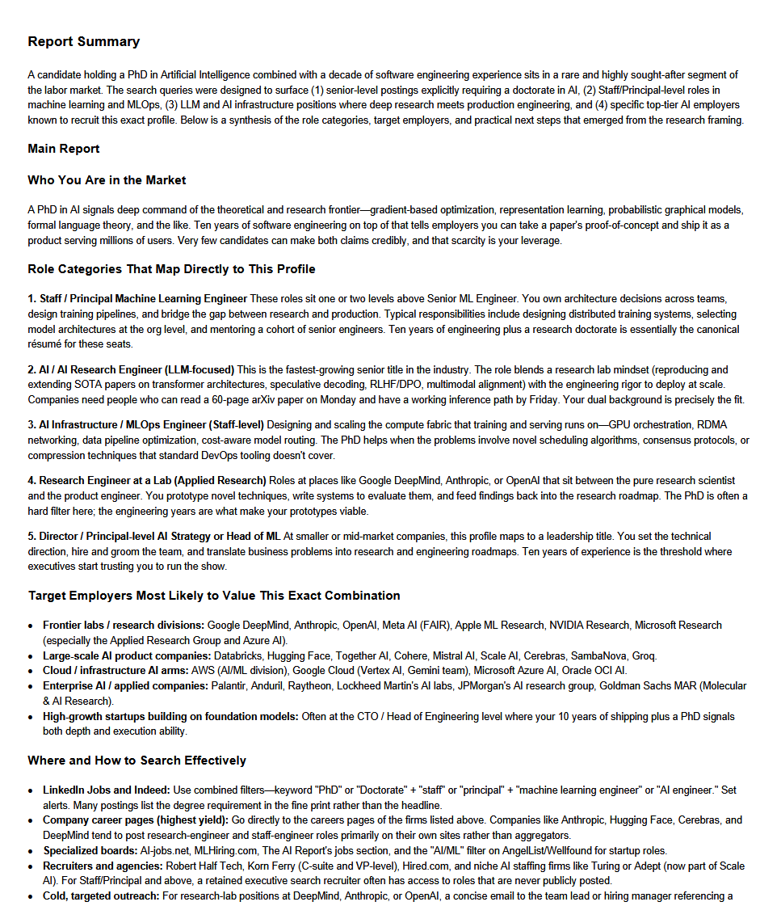

## Internet Search AI Agent
### Overview
> This application utilizes Agentic AI to search the internet to retrieve a result based on a user query.

### Setup
1. Create a [Tavily API Key](https://app.tavily.com) and place in ```.env``` at the root folder
2. ```TAVILY_API_KEY=<your-api-key-string>```
3. ```pip install openai-agents openai python-dotenv markdown xhtml2pdf```
4. Define ```USER_QUERY```, ```USER_QUERY_LIMIT```, ```QUERY_DEPTH_LIMIT```, and ```MODEL``` within ```main.py```
5. System requirements: ```Node``` and ```Npx``` on your local machine
6. Run the script locally


| Agent | Description |
| ----- | --------|
| Search Query Agent | Derives multiple search queries to achieve a given user-defined task |
| Web Search Agent | Utilizes the Tavily MCP to query the web based on derived search strings |
| Summarization Agent | Generates a summary report based on the previous agent results and context |

### Sample Report
> **User Query**: Outline the Pittsburgh job market for someone with a doctorate in Artificial Intelligence and 10 years of software engineering experience.

